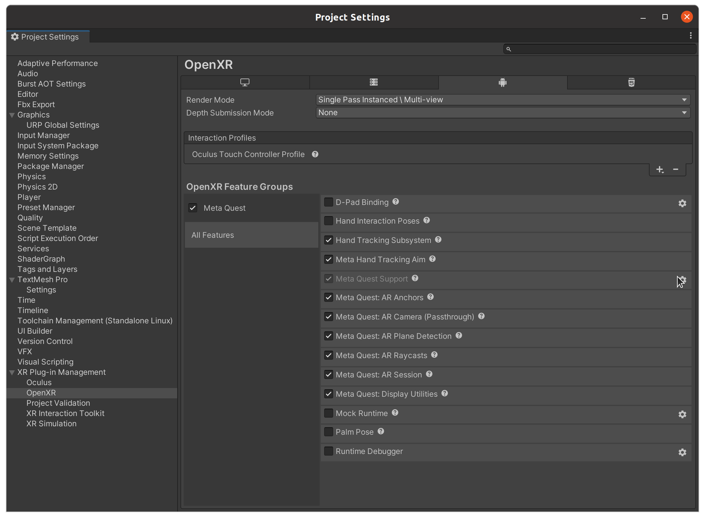

# Meta Quest Quickstart
To deploy on the Quest headset there are a three major steps to follow

1. Setup Quest in developer mode
2. Change the build settings in Unity
3. Build and deploy the app


## Setup Quest in developer mode

To deploy on the Quest, you need to enable developer mode on the headset. This is done by going to the [Meta Developer Dashboard](https://dashboard.oculus.com/) and creating a new organization. Once the organization is created, you can add a new app and enable developer mode. This will allow you to deploy apps from Unity to the Quest.

## Change the build settings in Unity

To build for the Quest, you need to change the build settings in Unity. This is done by going to `File -> Build Settings` and selecting Android as the platform. Once Android is selected, you can click the `Switch Platform` button. This will change the platform to Android and allow you to select the Quest as the device. Once the Quest is selected, you can click the `Build and Run` button to deploy the app to the Quest.


## Build and deploy the app

Once the build settings are changed, you can build and deploy the app to the Quest. This is done by clicking the `Build and Run` button in the build settings. This will create an APK file and deploy it to the Quest. Once the app is deployed, you can launch it from the Quest menu.


## Building with internet access

The most important thing for adding ROS support is to make sure the app has internet permissions. This is done by adding the following line to the `AndroidManifest.xml` file in the `Assets/Plugins/Android` folder.

```xml  
<uses-permission android:name="android.permission.INTERNET" />
```
Unfortunately, the Quest plugin has a bug that will continuously try to remove the internet permission each time you recompile code. To fix this, before you build you must open the Project Settings > XR Plugin Management > OpenXR and select the settings icon for "Meta Quest Support".



In the Meta Quest Support settings, disable the "Force Remove Internet" option. This will allow the internet permission to stay in the manifest file. This needs to be done before each build. If the APK is built once without doing this, you will need to make a change to the manifest file (add or remove a blank line), save it, uncheck the box, then rebuild.


## Things to keep in mind

- On Windows the [Quest Link ](https://www.meta.com/en-gb/help/quest/articles/headsets-and-accessories/oculus-link/set-up-link/) setup will allow you test the device immediately when you activate playmode. Make sure you enable quest link in the headset, and you should be in the Oculus menu
