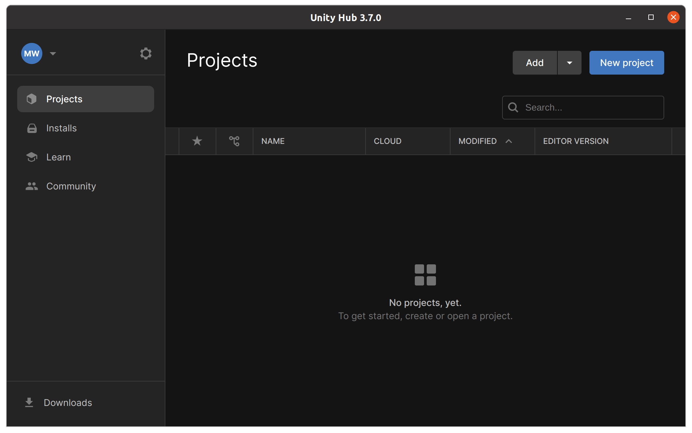
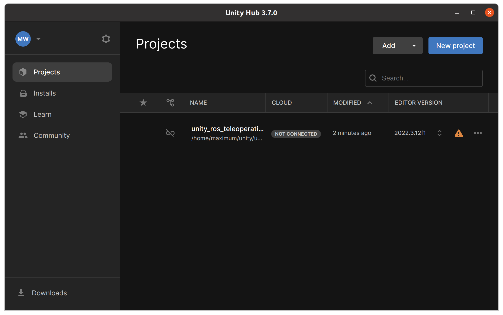
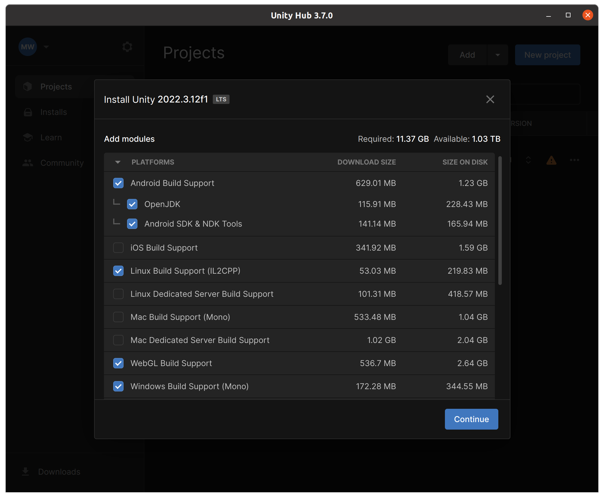
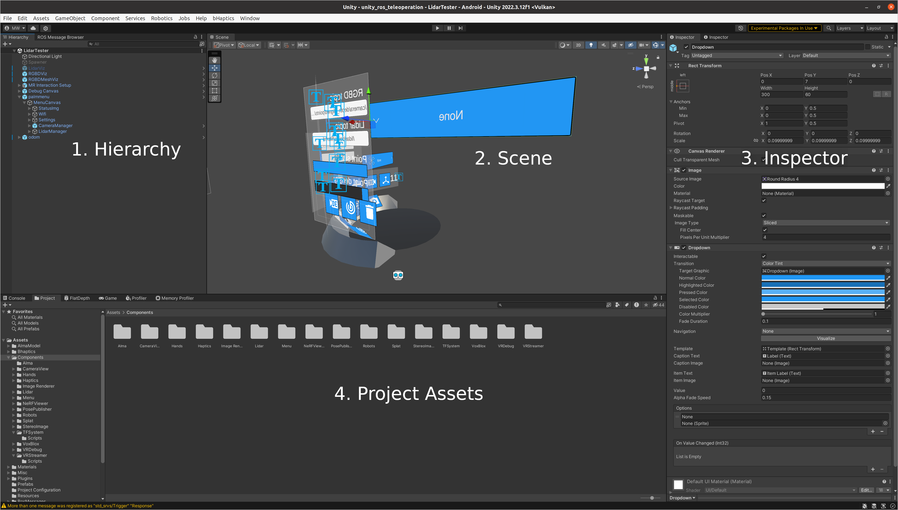

# Unity Quickstart
## Background
Unity is a game engine with extensive cross platform support and fairly simple to use workflows. Most code for Unity is written in C# with a few exceptions for shaders (HLSL) and plugins. To get started, download the [Unity Hub](https://unity.com/download) which works on Windows, Mac and Linux. 

## Adding Projects and Installs
Once you have Unity Hub installed, you can add projects and installs. The installs are the versions of Unity that you have installed on your system. The projects contains the Unity projects which are folders generally containing an `Assets` and `Packages` folder such as this repo. Projects are built with a specific version of Unity so it is recommended to install the version of Unity (or nearest LTS) that the project was built with.

Open Unity Hub and click the `Add` button. Navigate to the folder containing the Unity project and click `Select Folder`. The project should now appear in the list of projects and if the Editor is installed, it will launch Unity. If the Editor is not installed, there will be an option to install the editor by clicking the warning triangle.

Make sure to add Android support (along with JDK and Android SDK) as well as Linux Build support. For the most compatibility, the following is the recommended setup:

Once the editor is installed the project can be opened from the Projects menu.

## Unity Editor
The Unity Editor is the main interface for working with Unity projects. The editor is divided into several sections:

1. Hierarchy: The hierarchy is a list of all the GameObjects in the scene. Blue GameObjects are prefabs, while blue objects with a bar on the left have overrides applied. For UI elements, the higher the element in the hierarchy, the closer it is to the camera.

2. Scene: The scene is the 3D view of the level. It can be navigated with the right mouse button and WASD or middle mouse and alt left mouse button. 

3. Inspector: The inspector shows the properties of the selected GameObject. This includes the transform, components, and any public variables in the script. Values can be changed in the inspector both at runtime and in edit mode, allowing for quick change of public variables without the need to recompile. NOTE: Changes to the inspector made in play mode will not be saved.

4. Project: The project window shows all the assets in the project. This includes scripts, textures, models, and prefabs. Assets can be dragged into the hierarchy to create GameObjects or into the scene to add them to the scene.

## Adding Packages

Unity has a built in package manager from which you can import the two ROS packages. In this project these should already be linked in the `Packages/manifest.json` file. If you need to add them manually, go to `Window -> Package Manager` and click the plus icon in the top left. Then use `Add package from git URL` and add the following URLs: `https://github.com/leggedrobotics/ROS-TCP-Connector.git?path=/com.unity.robotics.ros-tcp-connector` and `https://github.com/leggedrobotics/ROS-TCP-Connector.git?path=/com.unity.robotics.visualizations`. This will link the ROS packages from the [ROS TCP Connector](https://github.com/leggedrobotics/ROS-TCP-Connector).

## Unity Basics
The main components to take note of in Unity are Components, GameObjects, Prefabs and Scenes.

### Components
Components are the building blocks of Unity. They are C# scripts that are attached to GameObjects to give them functionality. Components can be added to GameObjects by clicking the `Add Component` button in the inspector or by dragging the script onto the GameObject. When creating a new script Unity will automatically have it extend the MonoBehavior class which is the base class for all components. This not only allows the script to be attached to GameObjects but also gives access to the Unity lifecycle functions such as `Start` and `Update`, as well as displays all public variables in the inspector. For more information see [Monobehaviour Manual](https://docs.unity3d.com/Manual/class-MonoBehaviour.html).

### GameObjects
GameObjects are the main objects in Unity. They are containers for a collection of components, including a special transform component that defines the position, rotation, and scale of the GameObject. GameObjects can be created by right clicking in the hierarchy and selecting `Create Empty` or by dragging a prefab from the project window into the hierarchy. GameObjects can be parented to other GameObjects by dragging them onto the parent GameObject in the hierarchy. For more information see [GameObject Manual](https://docs.unity3d.com/Manual/GameObjects.html).

### Prefabs
Prefabs are GameObjects that have been saved to the project window. They can be dragged into the hierarchy to create a new instance of the GameObject. To create one, drag a GameObject from the hierarchy into an Assets folder. This allows GameObjects to easily be reused in multiple scenes where overrides can make slight adjustments from the original (this are highlighted in bold in the inspector), or allows you to make changes to the prefab and apply them to all instances. For more information see [Prefab Manual](https://docs.unity3d.com/Manual/Prefabs.html).

### Scenes
Scenes are the levels in Unity. They contain all the GameObjects and assets that make up the level. Scenes can be created by going to `File -> New Scene` or by saving the current scene with a new name. Generally scenes are meant to be created with a transition graph that allows the user to move between levels, however, they can also be used to create isolated testing environments for a specific component. For more information see [Scene Manual](https://docs.unity3d.com/Manual/CreatingScenes.html).

### Project Settings
Project settings are the settings that apply to the entire project. They can be accessed by going to `Edit -> Project Settings`. Some of the most important settings are the `Player` settings which control the build settings, the `Quality` settings which control the rendering quality, and the `Input` settings which control the input mappings. For more information see [Project Settings Manual](https://docs.unity3d.com/Manual/class-PlayerSettings.html).

## Things to keep in mind

- The general mono behavior lifecycle is `Awake`, `Start`, `Update`, `FixedUpdate`, `LateUpdate`, `OnDestroy`. Setup happens in `Awake` and `Start` while Update functions are tied to either the physics engine or frame rate. This means if your Update function takes a long time to execute, you will have frame drops. `OnDestroy` is used to clean up resources and should be used to remove listeners, ROS connections, and any shaders or textures that are not cleaned up by Unity's garbage collector. For more information see [Execution Order](https://docs.unity3d.com/Manual/ExecutionOrder.html).
- Unity uses a left handed coordinate system with Y as up. This means that the Z axis is forward and the X axis is right. This is important to keep in mind when working with ROS which uses a right handed coordinate system with Z as up. This can be confusing when working with URDFs and TFs as the axes will be flipped. For more information see [Coordinate Systems](https://docs.unity3d.com/Manual/QuaternionAndEulerRotationsInUnity.html).
